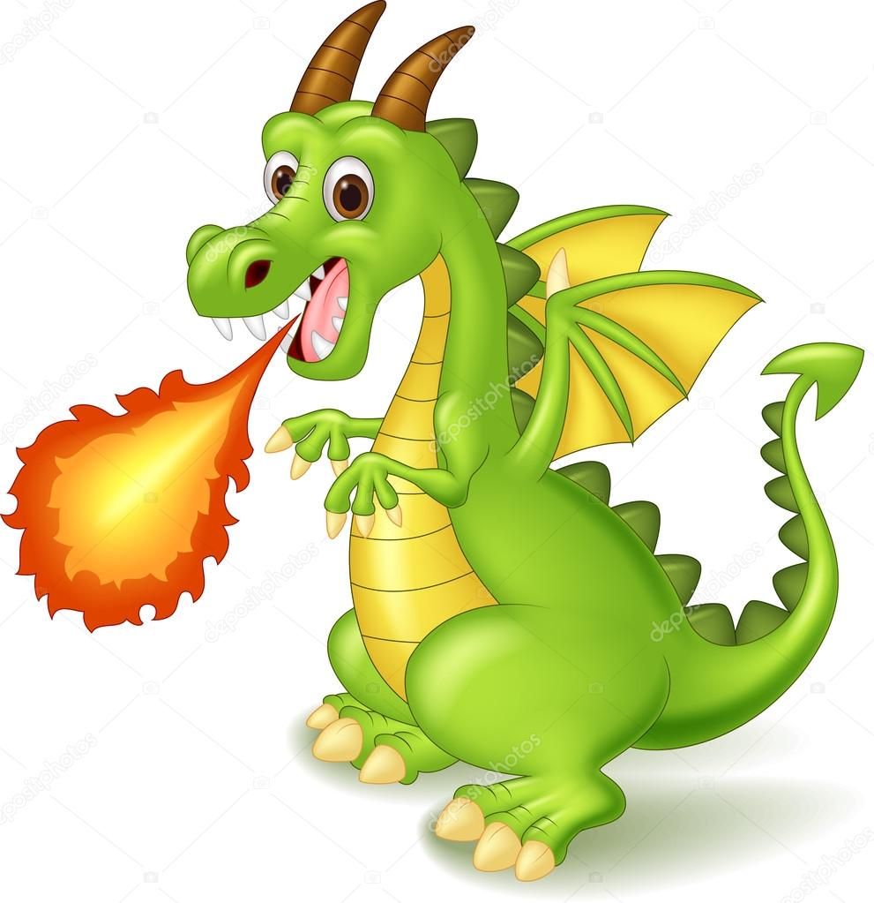
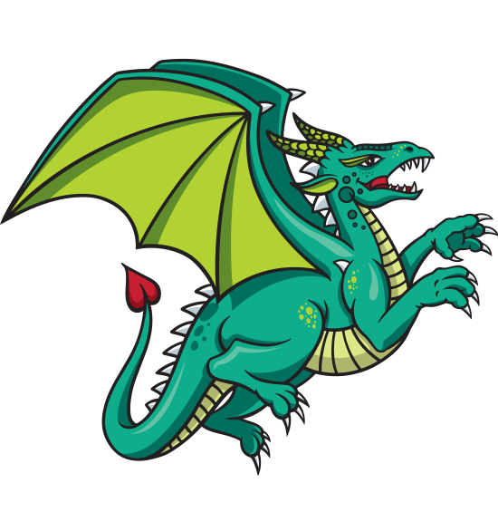

GitHub: https://github.com/BrookeHolmes/A7_Holmes_Brooke

Medieval Dragon
 
Medieval Dragon([Source](https://en.wikipedia.org/wiki/Dragon)))  

Cartoon Dragon
  
Cartoon Dragon ([Source](https://www.istockphoto.com/vector/cartoon-dragon-posing-with-fire-gm486859494-73500809)))  

Flying Dragon

Flying Dragon ([Source](https://www.feedyourdragon.com/about.html)))  

```{r}
library(ggplot2)
library(ape)
library(knitr)
library(reshape2)
library(ggtree)
library(ggimage)
```

```{r}
# Importing Data
DragonNexus <- read.nexus.data("input/DragonMatrix.nex")
WeightsDat <- read.csv("https://colauttilab.github.io/Data/Weights.csv")
```

```{r}
# Creating a single vector of weights
Weights <- paste0(WeightsDat$Weight,collapse="")
Weights <- strsplit(Weights,split="")[[1]]

# Converting each letter to a value
WeightsNum <- rep(NA,length(Weights))
for(i in 1:length(WeightsNum)){
  if(Weights[i] %in% LETTERS){
    WeightsNum[i] <- which(LETTERS == Weights[i]) + 9
  } else {
    WeightsNum[i] <- Weights[i]
  }
}
# Creating list of weights
WeightsNum <- as.numeric(WeightsNum)

# Multiplying the weight value by the trait vector for each dragon.
WtDragonNexus <- DragonNexus
for (i in 1:length(DragonNexus)){
  RepWeight <- DragonNexus[[i]] == 1
  WtDragonNexus[[i]][RepWeight] <- WeightsNum[RepWeight]
  RepWeight <- NA
}

WtDragonNexusDF <- data.frame(matrix(unlist(WtDragonNexus), ncol=length(DragonNexus[[1]]), byrow=T))
row.names(WtDragonNexusDF) <- names(WtDragonNexus)
WtDragonDist <- dist(WtDragonNexusDF,method='euclidean')
```


```{r}
# Plotting the Phylogeny
WtDragonTree <- fastme.bal(WtDragonDist)
# Removing X's from the labels
WtDragonTree$tip.label <- gsub("([^X]+)X*", "\\1", WtDragonTree$tip.label)  
# Colouring the new species added a different colour
WtDragonTree <- groupClade(WtDragonTree, .node = c(122, 123))  
ggtree(WtDragonTree, layout = 'fan', branch.length = 'none', aes(colour = group)) + geom_tiplab(size = 2, hjust = -.1)  
    
```
### __Figure 1.__*Phylogenic Tree Plot*
##### The blue and green lines represent the dragons I added (Medieval, Cartoon and Flying). Cartoon and Flying are more related to eachoher than either with Medieval, although they are closely related to Medieval. They are most closely related to Japanese dragons.


